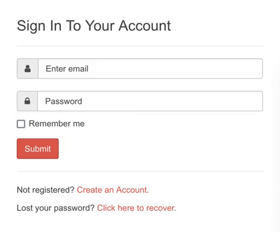
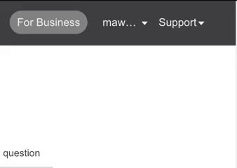
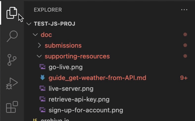
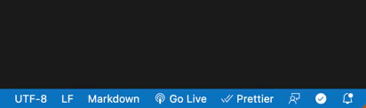

# Learn How to Fetch Data Using Javascript from an API

This guide shows you how to fetch external web API data so you can render the data in your web apps.

Although we will send requests to the [OpenWeatherMap API](https://openweathermap.org/guide), you may apply the same knowledge when requesting data from any web API or a local JSON file.

By the end of the guide, you will know how to:

- Construct an API request using Javascript
- Use dot notation to access nested API data
- Generate error messages when an API request fails
- Work with API data in your web app

## In This Guide

- [Learn How to Fetch Data Using Javascript from an API](#learn-how-to-fetch-data-using-javascript-from-an-api)
  - [In This Guide](#in-this-guide)
  - [Prerequisites](#prerequisites)
    - [Tools](#tools)
    - [Knowledge](#knowledge)
  - [Basic Concepts](#basic-concepts)
  - [Retrieve an API Key](#retrieve-an-api-key)
  - [Set Up Local Files](#set-up-local-files)
  - [Install Live Server Extension](#install-live-server-extension)
  - [Construct an API Request](#construct-an-api-request)
    - [Send Your First Request](#send-your-first-request)
    - [Declare Variables](#declare-variables)
    - [Test Your Connection](#test-your-connection)
  - [Access Nested API Data](#access-nested-api-data)
  - [Configure Error Messages](#configure-error-messages)
  - [Perform Operations on API Data](#perform-operations-on-api-data)
  - [Wrap API Data in HTML Elements](#wrap-api-data-in-html-elements)
  - [Explore the OpenWeatherMap API Further](#explore-the-openweathermap-api-further)
  - [Wrapping Up](#wrapping-up)

## Prerequisites

The following tooling and knowledge prerequisites are required to complete the steps in this guide.

### Tools

- Visual Studio Code
- A browser with Developer tools, like Google Chrome or Firefox

### Knowledge

- How to tie your shoes. I kid, I kid...
- Beginner-level Javascript knowledge

## Basic Concepts

You should understand these basic concepts before we apply them in this guide. After all, more knowledge makes you an A-game coder!

| Concept            | Description                                                                                                                                                                                                                                                                                     |
| ------------------ | ----------------------------------------------------------------------------------------------------------------------------------------------------------------------------------------------------------------------------------------------------------------------------------------------- |
| Fetch API          | It's the programmatic version of playing fetch with your virtual dog. Except, it isn't. The Fetch API provides a method for fetching resources (API data) using Javascript code. This guide will show you how to use the `fetch()` method to retrieve weather data from the OpenWeatherMap API. |
| OpenWeatherMap API | This API allows you to request free weather data for any location, including current weather, historical weather data, and forecasts.                                                                                                                                                           |
| Web API            | Web APIs, or web services, define the interaction between client applications and API servers. In our case, the client is the web browser, and OpenWeather is the API server.                                                                                                                   |

## Retrieve an API Key

An **API key** tells the API that you are authorized to send requests. You see, APIs have high-tech security systems that ID you before letting you in to play with their data.

In this guide, we need an API key for the OpenWeatherMap API. When you set up your web application later, you will include this key within the Javascript code.

To retrieve an API key, create an account with OpenWeather.

1. Go to the OpenWeather website [sign-in page](https://home.openweathermap.org/users/sign_in) and click **Create an Account**.



2. Provide the details and submit the **Create an Account** form.
3. Check your email for a new email from OpenWeather.
4. In this email, click the **Verify Email** button to verify your email.
   - You are then directed to the OpenWeather website.
5. In the top-right corner, click your profile name and select **My API keys**.



- Your API key is visible in the **Key** column.

6. Remember your API key! Just saying, bad things can happen...

## Set Up Local Files

You must set up a local project that will house your Javascript code.

1. With VS Code open, create two files: `index.html` and `main.js`.

The root directory of your project should look like the following:

```YAML
# File containing sample HTML and <script> tag
- index.html
# File containing your Javascript code
- main.js
```

2. Open `index.html` and paste the following code:

```html
<!DOCTYPE html>
<html lang="en">
  <head>
    <meta charset="UTF-8" />
    <meta http-equiv="X-UA-Compatible" content="IE=edge" />
    <meta name="viewport" content="width=device-width, initial-scale=1.0" />
    <title>Document</title>
  </head>
  <body>
    <script src="main.js"></script>
  </body>
</html>
```

Let's discuss the role of each file:

- `index.html` contains sample HTML and a `<script>` tag. The `<script>` tag ensures your Javascript code within `main.js` is run.

- `main.js` will contain all the Javascript written for this guide. It is empty at present.

## Install Live Server Extension

To view the result of your Javascript in the browser, you need to install a VS Code extension called **Live Server**.

1. Click the **Extensions** tab in VS Code.
2. Search for `Live Server`.



3. Click **Live Server** from the search results and click **Install**.

To launch the Live Server:

1. Ensure `index.html` is open in VS Code.
2. Click **Go Live** in the bottom-right corner of the application window.
   - A live, local server is launched that displays your web app.



> **Note:** No content will display in the browser since there are no viewable HTML elements.

## Construct an API Request

Next, we will begin populating `main.js` with Javascript code.

### Send Your First Request

1. In `main.js`, paste the following code:

```javascript
const apiKey = "";
const apiUrl = `https://api.openweathermap.org/data/2.5/weather?q=London&appid=${apiKey}`;
const container = document.querySelector("div.container");
fetch(apiUrl)
  .then((response) => response.json())
  .then((data) => {
    const temperature = data.main.temp;
    console.log(temperature);
  })
  .catch((error) => {
    let div = document.createElement("div");
    div.innerHTML = `<div style="width:100%;height:0;padding-bottom:75%;position:relative;"><iframe src="https://giphy.com/embed/3o6MbdPcxvF7Hb5G3S" width="100%" height="100%" style="position:absolute" frameBorder="0" class="giphy-embed" allowFullScreen></iframe></div><p><a href="https://giphy.com/gifs/season-14-the-simpsons-14x1-3o6MbdPcxvF7Hb5G3S">via GIPHY</a></p></div>
    `;
    container.appendChild(div);
  });
```

2. Save `main.js`.

View the response data in the browser:

1. In VS Code, with `index.html` open, click **Go Live** at the bottom right of the application window.
   - A local server initiates, and a new browser window, or tab, should open.

**Oh no!!! What happened???**

<iframe src="https://giphy.com/embed/3o6MbdPcxvF7Hb5G3S" width="480" height="360" frameBorder="0" class="giphy-embed" allowFullScreen></iframe><p><a href="https://giphy.com/gifs/season-14-the-simpsons-14x1-3o6MbdPcxvF7Hb5G3S">via GIPHY</a></p>

Oh...wait a minute. We forgot to add the API key as the value of the `apiKey` variable in our Javascript. Sorry, technical writers tend to get ahead of themselves sometimes.


Well, at least you know what happens when you forget to include your API key!

Let's start over and fix our Javascript file.

### Declare Variables

Okay, let's give this another shot. This time we won't forget our API key (at least, I hope not).

At the top of `main.js`, we will initialize two variables to store the values of the API key you retrieved earlier and the API URL.

1. Delete all code in `main.js`.
2. Add the following code at the top of `main.js`:

```javascript
const apiKey = "your API Key";
const apiUrl = `https://api.openweathermap.org/data/2.5/weather?q=London&appid=${apiKey}`;
```

3. Insert your API key by replacing `your API key` with your real API key.

The API URL is an endpoint for retrieving weather data. The API URL contains the query string parameter `London`. Use query strings to filter the data returned by APIs. In this case, the query string parameter tells the API to return `London` weather data.

### Test Your Connection

Test your connection to the API by sending a request.

1. In `main.js`, paste the following code:

```Javascript
// Fetch API data by passing a resource URL.
fetch(apiUrl)
  // Convert the response JSON to a JS object.
  .then((response) => response.json())
  // Then take this data...
  .then((data) => {
    // And print it to the web console.
    console.log(data);
    // Ignore the code below.
    let div = document.createElement("div");
    div.innerHTML = `<iframe src="https://giphy.com/embed/3orif3NCyKZ61frBHa" width="480" height="360" frameBorder="0" class="giphy-embed" allowFullScreen></iframe><p><a href="https://giphy.com/gifs/season-14-the-simpsons-14x11-3orif3NCyKZ61frBHa">via GIPHY</a></p>`;
    container.appendChild(div);
  });
```

Let's break down the important bits of code:

- The `fetch()` method allows you to fetch API data by passing an API URL as an argument. You are passing the variable created earlier used to store the API URL.

- If successful, a `response` object containing the data you requested is returned in JSON format.

- The `json()` method accepts the JSON `response` data, parses it, and produces a Javascript object.

- Finally, `console.log(data)` prints the returned API `data` to the console. The London weather `data` is printed to the console.

- Ignore everything after `console.log(data)`. _Hopefully, it's not another corny GIF to make a point..._

2. In VS Code, with `index.html` open, click **Go Live** at the bottom right of the application window.
   - A local server initiates, and a new browser window, or tab, should open.

Congratulations, you successfully connected to the API!

<iframe src="https://giphy.com/embed/3orif3NCyKZ61frBHa" width="480" height="360" frameBorder="0" class="giphy-embed" allowFullScreen></iframe><p><a href="https://giphy.com/gifs/season-14-the-simpsons-14x11-3orif3NCyKZ61frBHa">via GIPHY</a></p>

Sorry, I know I said I wouldn't...


Okay, jokes aside.

3. Right-click anywhere in the browser, and select **Inspect**.
   - The Developer tools dashboard opens.
4. Click the **Console** tab.
   - In the **Console**, notice that the object contains dozens of properties that contain weather data for London.

> **Note:** Verify your API key if you receive a `401` error. Note that sometimes it takes several hours before your API key is ready to be used after creating an account.

## Access Nested API Data

What if we only wanted to request data for specific properties? We can do this using something called **dot notation** in Javascript.

Let's use dot notation to only request London's temperature.

1. Keep the variable declarations at the top of `main.js`.
2. Update the `fetch()` method to look like the following:

```Javascript
fetch(apiUrl)
  .then(response => response.json())
  .then(data => {
    // Access the value of the temperature property and save it to a variable.
    const temperature = data.main.temp;
    console.log(temperature);
  })
```

You'll notice there are no corny gifs in the code this time!

Let's break down the important bits of code:

- You already know what the `fetch()` and `json()` methods do.

- Instead of requesting all of London's weather data in one Javascript object, we use dot notation to access London's temperature.

- We do this by writing the high-level object `data` followed by `.` and the property `temp`. We are using dot notation to access the value of the `temp` property.

- We save this value to the variable `temperature` and print the `temperature` to the console.

3. Open the **Console** in your web browser.
   - You should see a value like `287.47` for London's temperature in Kelvin.

## Configure Error Messages

Well, we have already had a lot of fun with error messages. When we forgot to add our API key earlier, a function ran that rendered the **Access Denied!** GIF in the browser.

So let's discuss error messages in more detail.

What happens if there is an issue and the API cannot return data? API requests fail for many reasons. Sometimes, it's not even your fault. Maybe the API is down, or we forgot the API key...


Okay, okay, I get it. Tech writers _really_ know how to entertain themselves...

In all seriousness, you may wish to generate an error message to indicate an API request failed.

Inside your Javascript code, you can use the `catch()` method to run a function when the API rejects a request. For example, you can print a specific error message.

1. In `main.js`, update the `fetch()` method to look like the following:

```Javascript

fetch(apiUrl)
  .then((response) => response.json())
  .then((data) => {
    const temperature = data.main.temp;
    console.log(temperature);
  })
  // If the API rejects the request, run the following function that prints an error to the console.
  .catch((error) => {
    console.error("Error fetching weather data", error);
  });

```

2. Now, remove any three characters from your API Key.
   - This results in an invalid API key that will trigger the error message in the console.
3. Save `main.js`.
4. Ensure **Live Server** is running.
5. In your browser, open your **Console**.
   - The error message should display.

Great, now you know how to create custom error messages!

## Perform Operations on API Data

Oftentimes we would like to manipulate data returned by an API. We can use the data any way we would like.

In your relationship with an API, it is okay to be manipulative!


Oh, geez, here I go again...no wonder I cannot keep a job.

Alright, alright. Let's take London's temperature in Kelvin and convert it to Fahrenheit. Before beginning, change your API key back to the correct value.

1. Update the `fetch()` method to look like the following:

```Javascript

fetch(apiUrl)
  .then((response) => response.json())
  .then((data) => {
    const temperature = data.main.temp;
    console.log(temperature);
    // Declare 3 variables to store each type of temperature.
    const temperatureKelvin = data.main.temp;
    const temperatureCelsius = temperatureKelvin - 273.15;
    const temperatureFahrenheit = (temperatureCelsius * 9) / 5 + 32;
  })

```

Let's break down the important bits of code:

- The temperature in Kelvin returned by the API is saved to a variable.
- The temperature is converted to Celsius and saved to another variable.
- Finally, the temperature in Celsius is converted to Fahrenheit, saved to a variable, and printed to the console.

2. View your **Console** logs.
   - London's temperature in Fahrenheit should be visible.

## Wrap API Data in HTML Elements

So far, we have only printed API data to the console. While this is useful, how do we create something we can see in the browser?

To do this, we can use Javascript to generate HTML elements that wrap the API data.

1. In `index.html`, add the following code below the `<body>` element and above the `<script>` tag.

```html
<div class="container"></div>
```

- This container will hold the HTML elements generated shortly.

2. In `main.js`, replace the entire `.fetch()` method with the following code (keep the variable declarations at the top):

```javascript
fetch(apiUrl)
  .then((response) => response.json())
  .then((data) => {
    const temperature = data.main.temp;
    console.log(temperature);
    const temperatureKelvin = data.main.temp;
    const temperatureCelsius = temperatureKelvin - 273.15;
    const temperatureFahrenheit = (temperatureCelsius * 9) / 5 + 32;
    console.log(temperatureFahrenheit);

    // Create an array of objects containing temperature data for each temperature type.

    const temperatureArray = [
      {
        temperatureValue: temperatureKelvin,
        temperatureType: "Kelvin",
      },
      {
        temperatureValue: temperatureCelsius,
        temperatureType: "Celsius",
      },
      {
        temperatureValue: temperatureFahrenheit,
        temperatureType: "Fahrenheit",
      },
    ];
    // Loop through each array element and create a new <div> each time.

    temperatureArray.forEach(function (item) {
      let div = document.createElement("div");
      div.textContent = `The temperature is ${item.temperatureType} in: ${item.temperatureValue}`;
      container.appendChild(div);
    });
  });
```

Let's break down the important bits of code:

- We are creating an array to store the temperature data for each temperature type in separate objects for Celsius, Kelvin, and Fahrenheit, respectively.

- We are looping through each array object using the `forEach()` method. For every item (or array object) in the array, a new `<div>` element is generated.

3. View the results in the browser.
   - The generated HTML should look like the following (with different values, of course):

```
The temperature in Kelvin is: 279.23
The temperature in Celsius is: 6.080000000000041
The temperature in Fahrenheit is: 42.944000000000074
```

## Explore the OpenWeatherMap API Further

Great work! You have become an all-star, API fetching, javascript-writing, web developing, super user...

Ah, you get the point.

The OpenWeatherMap API provides more data than we covered in this guide. When you first printed the entire data object returned by the API, you may have noticed hundreds of properties.

Using the instructions in this guide, you can access more API data by using **dot notation** to access nested properties.

We also only used one endpoint in this guide. OpenWeather has dozens of endpoints that each return unique data. Check out OpenWeather's [documentation](https://openweathermap.org/guide) and experiment with their other API endpoints!

## Wrapping Up

Even though there were a few corny jokes along the way, you've done it!

This guide has taught you how to fetch data from a web API using Javascript. You learned how to use dot notation to access specific properties within the response object, how to configure error messages, and how to generate HTML elements that wrap the API data.

With this knowledge, you can fetch data from any web API and use the returned data in your web application.

Happy fetching!
